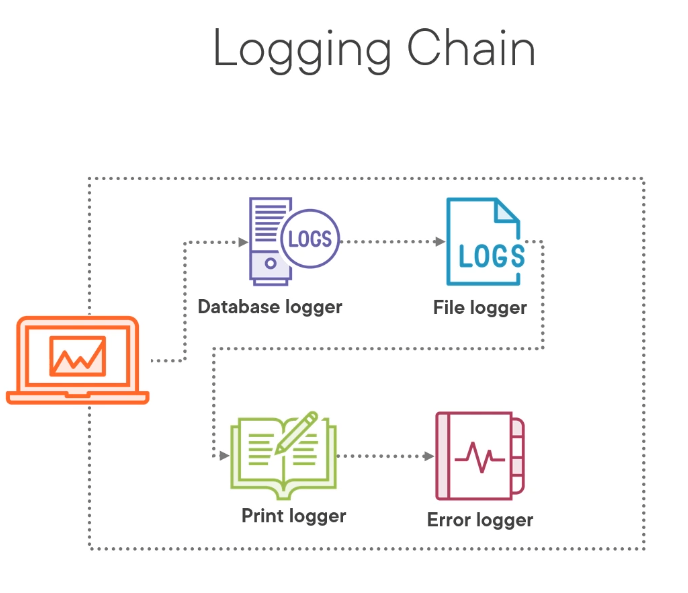

### Chain of Responsibility

In a logging example application could take the responsibility of selecting
the logger and sending it, but this would couple the application tightly to the logger.

And also this promotes code duplication anti-pattern where the functionality is hard to share.

Preferable approach is to pass the logging request down the chain of handlers until it is handled.

#### [Separation of concerns - wiki](https://en.wikipedia.org/wiki/Separation_of_concerns)
* Object-oriented programming languages such as C#, c++ etc. can separate concerns into objects.
* Arhcitectural design patterns like MVC or MVP can separate presentation and the data-processing(model) from content.
* Service-oriented design can separate concerns into services.
* Procedural programming languages can separate concerns into procedures or functions.
* Aspect-oriented programming can separate concerns into aspects and objects.

#### Structure

* Handler - implements interface for handling
* ConcreteHandler - handles a request if able or pass it to next item on the chain
* Client - initiates the request to a ConcreteHandler on the chain

#### Things to notice
* Requests can be handled by multiple handlers
* Introduces more code
* Does not guarantee processing