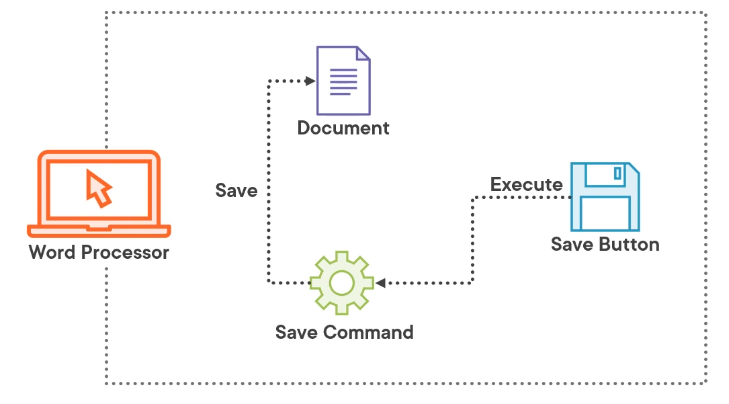

#### Command pattern

#### Gang of four quote
"Encapsulate arequest as an object thereby letting you parameterize clients different requests, queue or log requests and support undoable operations."

#### Structure
*Command* - Declares an interface for executing an operation
*ConcreteCommand* - Connects Receiver with an action and implements Execute
*Client* - Creates and schedules ConcreteCommands
*Invoker* - Runs the command
*Receiver* - Performs the operations requested by the command

Why Command?

- Separation of concers
- Decoupled code
- Highly extensible
- Testable
- Maintainable