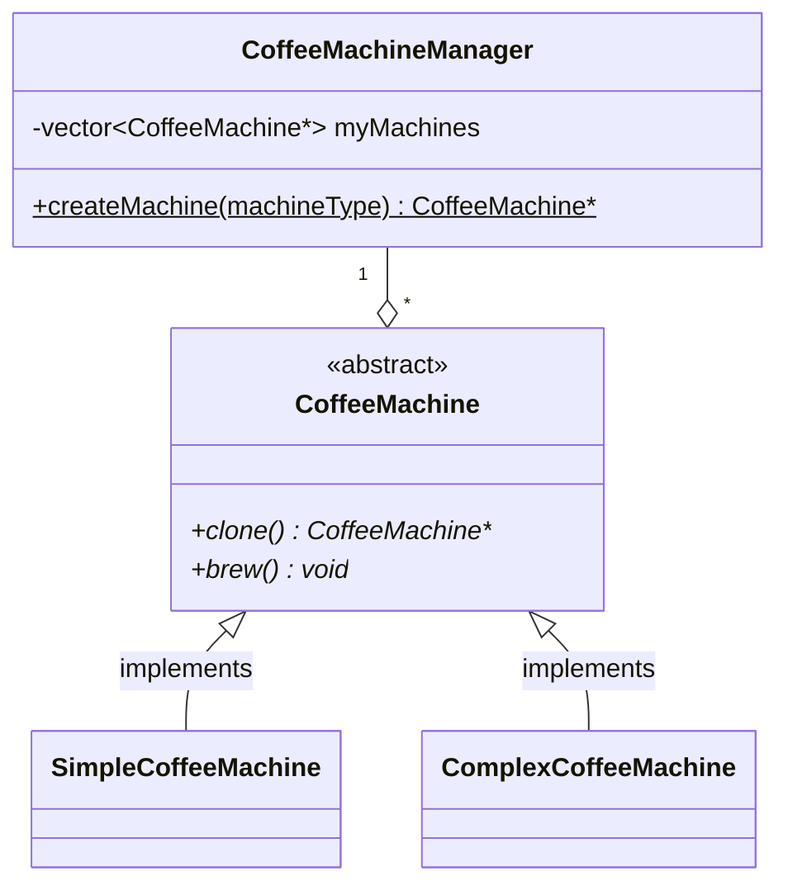

### Creational Design Pattern
An object-oriented design pattern that focuses on improving object instantion.

### Singleton Pattern
Why use the singleton pattern:
- to ensure that an object is only instantiated once.
- to use global state in your program or app.
- to provide a central location for shared state.

### Builder Pattern
Why use the builder pattern:
- to allow customization of object construction
- to provide a declarative, step-by-step API for object creation
- to simplify object construction

### Prototype Pattern
Why use the prototype pattern:
- to clone/copy large objects
- to accomodate constant need to reconfigure created objects
- to create dynamic object

