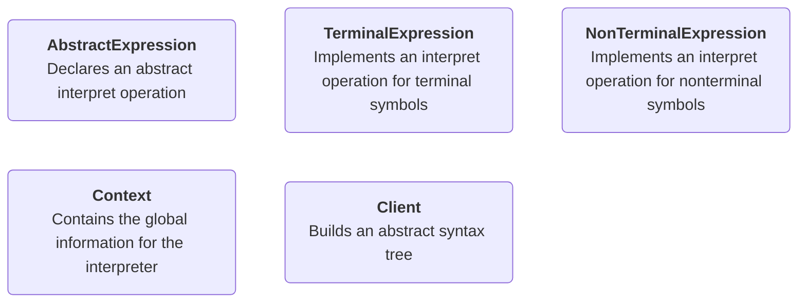

### Interpreter pattern

#### Gang of four quote
>Given a language, define a representation for its grammer along with an interpreter that uses the representation to interpret sentences in the language.

#### Calculator example
Expression `1+2`

`1`, `2` are terminal symbols
`+` is non terminal

In other words the `1` and `2` are child nodes of the `+` symbol and the `+` symbol has no child nodes.

To implement the interpreter pattern one has to implement lexing and parsing.

#### Interpreter structure

#### Why Interpreter?
- Express recurring problems as language
- Decrease complexity
- Increase efficiency
- Regular expressions
