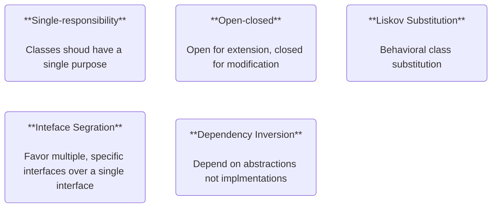
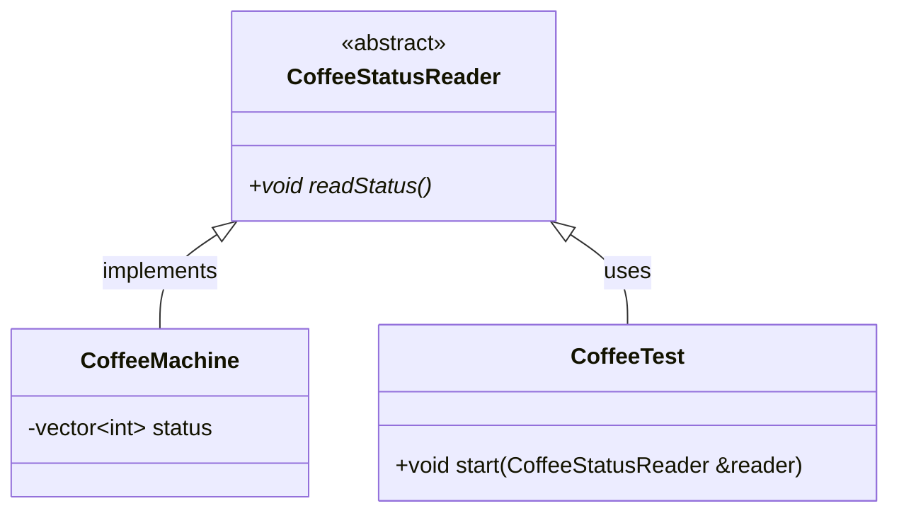

## SOLID Design Principles

A set of object-oriented design principles that aim to ehlp developers to write code that is easily extensible, maintainable and more reusable.



Following the solid principles results in code that is:
- more extensible
- easier to maintain
- more reusable

### Single-responsibility Principle

Every class/module should be responsible for one portion of the overall system.

Separating the concerns (details) will effectively avoid hard to follow "spaghetti" code.

For example a coffee machine should not be concerned about details of sending metrics.
```C++
// Many responsibilities
class JackOfAllTrades_CoffeeMachine
{
    . . .
    void brewCoffee()
    {
        std::cout << "Brewing coffee\n";
    }

    void sendCoffeeMetrics()
    {
        // Floaded with details of implementation.
        // Resulting in the need of direct changes in this class
        // whenever the details of sent metrics change.
        UrlRequest request;
        std::cout << "Sending metrics...\n";
        request.uri("/metrics");
        . . .
        request.perform();
    }
}

class SingleResponsibility_CoffeeMachine
{
    . . .
    void brewCoffee()
    {

    }

    void sendCoffeeMetrics()
    {
        // Has no concerns about details of sending metrics
        // and requires no direct changes whenever the details
        // of sent metrics change.
        std::cout << "Sending metrics...\n";
        _coffeeService.SendMetrics(_metrics);
    }
}
```

### Open-closed Princible

It should be easy to extend a class's behavior without changing the code of the class itself.

Following the open-closed princible will
- allow to keep existing functionality intact while implementing requirement changes by extending the functionality.
- help in creating well-defined API.
- create reusable code.

```C++
class NotSoExtendable_CoffeeMachine {
    . . .
private:
    // Settings are fixed
    std::vector<int> settings = {1, 2, 3}

    void roastBySetting(int setting)
    {
        // class is not open for extension
        // and encourages no forces direct changes
        // whenever new setting is introduced
        switch (setting)
        {
            case 1:
            . . .
            case 2:
            . . .
        }
    }
}

class OpenForExtension_CoffeeMachine {
    . . .
    void roastBySetting(RoastSetting setting) {
        // Settings abstraction to a type 
        // allows it to change dynamically
        roastingService.roast(&setting);
    }
}
```

### Liskov Substitution (Behavioral subtyping)
If type "A" is derived from type "B" then you should be able to substitute objects of type "B" for objects of type "A".

Following Liskov Substitution Principle (LSP) benefit in:
- more flexibility
- well-defined abstractions
- more reusable code

```c++
class Roaster
{
public:
    virtual void roast() = 0;
}

class CoffeeRoaster
 : public Roaster
{
public:
    virtual void roast() override
    {
        // Specific coffee implementation
    }
}

class EspressoRoaster
  : public Roaster
{
public:
    virtual void roast() override
    {
        // Specific espresso implementation
    }
}
. . . Usage
void roast(Roaster roaster) {
    roaster.roast();
}
```

### Interface Segregation Principle (ISP)

Clients using your code should not be forced into depending upon methods or other abstractions that they don't need.

Following the ISP will benefit in:
- possible reduction of compile time.
- improved maintainability.
- proper separation of concerns

Example demonstrating the opposite of following ISP
```c++
class ISPViolationMachine
{
public:
    virtual void roast() = 0;
    virtual void pour() = 0;
    virtual void grind() = 0;
}

class AllInOneCoffeeMachine
 : public ISPViolationMachine
{
public:
    virtual void roast() override
    {
        // do some roasting
    }
    virtual void pour() override
    {
        // pouring coffee
    }
    virtual void grind() override
    [
        // grinding coffee
    ]
}

class SimpleMachine
  : public ISPViolationMachine
{
public:
    virtual void pour() override
    {
        // only does pouring
    }

    // Still has to implement unneeded methods
    virtual void pour() { /* do nothing */ }
    virtual void grind() { /* do nothing */ }
}
```
Apply ISP to the previous example
```c++
struct Roaster { virtual void roast() = 0; }
struct Pourer { virtual void pour() = 0; }
struct Grinder { virtual void grind() = 0; }

struct RobustMachine : Roaster, Pourer, Grinder {

}

class AllInOneCoffeeMachine
 : public RobustMachine
{
public:
    virtual void roast() override
    {
        // do some roasting
    }
    virtual void pour() override
    {
        // pouring coffee
    }
    virtual void grind() override
    [
        // grinding coffee
    ]
}

class SimpleMachine
  : public Pourer
{
public:
    virtual void pour() override
    {
        // only does pouring
    }
}
```

### Dependency Inversion Principle (DIP)
High-level modules (classes which depend upon other, low-level classes of a program) should not depend on low-level modules directly. They should both depend upon an abstraction.

Following the DIP will benefit in:
- flexible coupling of software modules
- significantly improved code reusability
- proper separation of concerns

Example in need of DIP 
```c++
class CoffeeMachine {
    vector<int> status;
    ...
}

class CoffeeTest {
    // Directly coupled to the CoffeeMachine class implementation.
    void start(CoffeeMachine &machine) {
        for (auto bit: machine.status) {
            // operate on status bits
        }
    }
}
```
Apply DIP to the previous example:
```c++
// Interface to which both low and high level depend upon
struct CoffeeStatusReader
{
    virtual void readStatus() = 0;
}

// Low-level "module"
class CoffeeMachine
 : public CoffeeStatusReader
 {
    vector<int> status;
    // Directly coupled to the CoffeeMachine class implementation.
    virtual void readStatus() override
    {
        for (auto bit: machine.status) {
            // operate on status bits
        }
    }
}

// High-level module is no longer directly coupled (dependent) upon the
// low-level implementation. They both depend on the abstraction CoffeeStatusReader.
class CoffeeTest
{
    void start(CoffeeStatusReader& reader)
    {
        reader.readStatus();
    }
}
```

